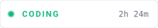
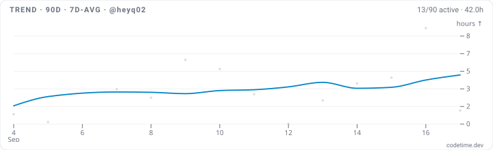

# Hi 👋, I'm Heyq

Welcome to my corner of GitHub.

## 📊 CodeTime

  
  

Widgets refresh automatically every 30 minutes via GitHub Actions.

## Contact    

  
  
    
    
    
    </a>
    
    </a>
    
    </a>
    

