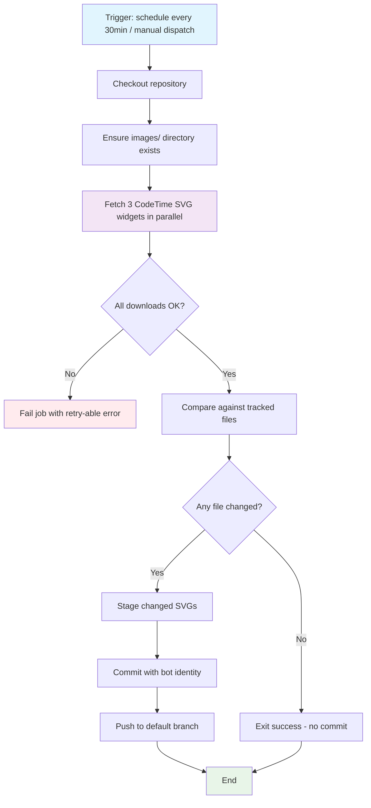

## Workflow Overview

**Purpose**: Periodically fetch three CodeTime widget SVG images from the remote CodeTime API, persist them to the local `images/` directory, and commit any changes so `README.md` renders always-fresh badges from local assets rather than hotlinked remote URLs.

**Trigger Events**:
- Scheduled: every 30 minutes (cron)
- Manual: `workflow_dispatch` for ad-hoc refresh
- Optional: `push` on the workflow file itself for self-test

**Target Environments**: GitHub-hosted runner (Linux); commits pushed to the repository default branch (`main`).

## Execution Flow Diagram



## Jobs & Dependencies

| Job Name | Purpose | Dependencies | Execution Context |
|----------|---------|--------------|-------------------|
| sync-widgets | Download, diff, commit and push CodeTime widget SVGs | None | `ubuntu-latest`, default `GITHUB_TOKEN` with `contents: write` |

## Requirements Matrix

### Functional Requirements

| ID | Requirement | Priority | Acceptance Criteria |
|----|-------------|----------|---------------------|
| REQ-001 | Run automatically every 30 minutes | High | Cron schedule `*/30 * * * *` present; last-run timestamp confirms cadence |
| REQ-002 | Support manual invocation | High | `workflow_dispatch` trigger defined; a manual run completes successfully |
| REQ-003 | Fetch CodeTime **Status** widget SVG | High | File `images/codetime-status.svg` present, non-empty, valid SVG |
| REQ-004 | Fetch CodeTime **Usage (24h)** widget SVG | High | File `images/codetime-usage.svg` present, non-empty, valid SVG |
| REQ-005 | Fetch CodeTime **Trend (90 days)** widget SVG | High | File `images/codetime-trend.svg` present, non-empty, valid SVG |
| REQ-006 | Preserve query parameters (`uid=37640`, `theme=light`, `style=minimal`, `range=24h`, `days=90`) | High | Downloaded assets match visual output of original hotlinked URLs |
| REQ-007 | Commit only when file contents change | High | Idle runs (unchanged SVGs) produce zero new commits |
| REQ-008 | `README.md` references local images from `images/` | High | README badges resolve to `images/*.svg`, not `codetime.dev` URLs |
| REQ-009 | Preserve README badge link targets (`https://codetime.dev`) | Medium | Clicking a badge in rendered README navigates to `https://codetime.dev` |
| REQ-010 | Use a stable commit author identity for automated commits | Medium | Commits authored by `github-actions[bot]` or configured bot user |

### Security Requirements

| ID | Requirement | Implementation Constraint |
|----|-------------|---------------------------|
| SEC-001 | No hard-coded secrets in workflow | Use built-in `GITHUB_TOKEN` only |
| SEC-002 | Least-privilege token scope | `permissions: contents: write` at job scope only |
| SEC-003 | Downloaded content restricted to expected origin | Only fetch from `https://codetime.dev/api/widgets/*` |
| SEC-004 | Do not execute or evaluate downloaded content | Treat SVGs as static assets; never `source` or render server-side |
| SEC-005 | Prevent workflow-in-workflow recursion | Automated commit must not re-trigger this workflow (path filters or `[skip ci]` convention) |

### Performance Requirements

| ID | Metric | Target | Measurement Method |
|----|-------|--------|--------------------|
| PERF-001 | End-to-end workflow duration | ≤ 60 seconds (p95) | GitHub Actions run duration |
| PERF-002 | Download step duration | ≤ 15 seconds (p95) | Step timing in job log |
| PERF-003 | Runner minutes per day | ≤ 60 minutes (48 runs × ~1 min) | Billing dashboard |

## Input/Output Contracts

### Inputs

```yaml
# Triggers
schedule:
  - cron: "*/30 * * * *"   # Every 30 minutes (UTC)
workflow_dispatch: {}       # Manual trigger, no inputs

# Static Configuration (embedded in workflow, not secrets)
CODETIME_UID: "37640"
WIDGETS:
  - name: status   url_path: "status.svg?uid=37640&theme=light&style=minimal"
  - name: usage    url_path: "usage.svg?uid=37640&theme=light&style=minimal&range=24h"
  - name: trend    url_path: "trend.svg?uid=37640&days=90&theme=light"

# Repository State
paths_written: ["images/codetime-status.svg", "images/codetime-usage.svg", "images/codetime-trend.svg"]
```

### Outputs

```yaml
# Job Outputs (optional, for downstream consumption)
changed:        boolean   # Whether any SVG changed this run
commit_sha:     string    # SHA of new commit, or empty if no change

# Filesystem Side-Effects
images/codetime-status.svg:  file  # Fresh CodeTime Status widget
images/codetime-usage.svg:   file  # Fresh CodeTime Usage (24h) widget
images/codetime-trend.svg:   file  # Fresh CodeTime Trend (90d) widget
```

### Secrets & Variables

| Type | Name | Purpose | Scope |
|------|------|---------|-------|
| Secret | `GITHUB_TOKEN` | Auth for git push (auto-provided) | Workflow |
| Variable | — | None required | — |

## Execution Constraints

### Runtime Constraints

- **Timeout**: `timeout-minutes: 5` per job (hard ceiling)
- **Concurrency**: `concurrency: { group: codetime-sync, cancel-in-progress: true }` — prevent overlapping runs
- **Resource Limits**: Standard GitHub-hosted runner defaults are sufficient

### Environmental Constraints

- **Runner Requirements**: `ubuntu-latest`
- **Network Access**: Outbound HTTPS to `codetime.dev`
- **Permissions**: `contents: write` (commit + push); no other scopes required

## Error Handling Strategy

| Error Type | Response | Recovery Action |
|------------|----------|-----------------|
| Network failure on widget fetch | Retry up to 3 times with exponential backoff | Fail job if all retries exhausted; next scheduled run auto-retries |
| Non-200 HTTP response | Log status + body; fail step | Skip commit; alert via workflow failure notification |
| Empty / zero-byte SVG | Treat as failure; do not overwrite existing file | Preserve last-good asset; fail job |
| Downloaded content not a valid SVG | Fail before staging | Preserve last-good asset; fail job |
| Git push rejected (non-fast-forward) | Rebase onto latest default branch and retry once | If retry fails, exit with error |
| Rate limiting from `codetime.dev` | Detect 429; back off | Wait until next scheduled slot |

## Quality Gates

### Gate Definitions

| Gate | Criteria | Bypass Conditions |
|------|----------|-------------------|
| Content Integrity | Each downloaded file starts with `<svg` or `<?xml` and is > 0 bytes | Never bypass |
| Origin Validation | Response comes from `codetime.dev` over HTTPS | Never bypass |
| Diff Gate | Commit only when `git diff --quiet` reports differences | Never bypass |
| Loop Prevention | Automated commit does not retrigger this workflow | Enforced via path filters / commit-message convention |

## Monitoring & Observability

### Key Metrics

- **Success Rate**: ≥ 98% over rolling 7-day window
- **Execution Time**: p95 ≤ 60s
- **Commit Frequency**: Expected 5–48 commits/day (varies with user activity)
- **Freshness**: `images/*.svg` mtime ≤ 35 minutes behind current time during active hours

### Alerting

| Condition | Severity | Notification Target |
|-----------|----------|---------------------|
| 3 consecutive scheduled runs fail | High | Repository owner via GitHub notifications |
| Widget file unchanged for > 24h despite successful runs | Medium | Repository owner (possible upstream stale response) |
| Workflow disabled by GitHub (60-day inactivity rule) | Medium | Repository owner |

## Integration Points

### External Systems

| System | Integration Type | Data Exchange | SLA Requirements |
|--------|------------------|---------------|------------------|
| `codetime.dev` widget API | Outbound HTTPS GET | Request: URL with query params → Response: SVG document | Best-effort; no formal SLA |
| GitHub Git API | Native (checkout + push) | Repository tree updates | Standard GitHub Actions availability |

### Dependent Workflows

| Workflow | Relationship | Trigger Mechanism |
|----------|--------------|-------------------|
| None | — | — |

## Compliance & Governance

### Audit Requirements

- **Execution Logs**: Retained by GitHub Actions (default 90 days)
- **Approval Gates**: None (fully automated); manual dispatch requires repo write access
- **Change Control**: Workflow file changes reviewed via standard PR process

### Security Controls

- **Access Control**: Workflow modifications require repository write access
- **Secret Management**: No custom secrets; rotation N/A
- **Vulnerability Scanning**: Not applicable (no code build); GitHub Dependabot may pin action versions

## Edge Cases & Exceptions

### Scenario Matrix

| Scenario | Expected Behavior | Validation Method |
|----------|-------------------|-------------------|
| Upstream API returns HTTP 5xx | Retry with backoff, then fail run; no commit; next slot retries | Inspect run logs |
| Upstream returns identical SVG (no user activity) | Detect via diff; skip commit | Confirm no new commit created |
| Upstream returns different but visually identical SVG (timestamp only) | Commit occurs; acceptable churn | Manual inspection if excessive |
| `images/` deleted between runs | Recreate directory before download | Directory-ensure step |
| Default branch renamed | Workflow follows configured `github.ref_name` for default branch | Verify after rename |
| Multiple triggers overlap | Concurrency group cancels in-progress older run | GitHub Actions concurrency semantics |
| PAT/`GITHUB_TOKEN` expired or revoked | Push fails; workflow errors | Failure notification |
| Repository archived / read-only | Push fails; alert owner | Failure notification |

## Validation Criteria

### Workflow Validation

- **VLD-001**: A successful run produces (or leaves unchanged) exactly three files under `images/`.
- **VLD-002**: `README.md` renders three CodeTime badges sourced from `images/` paths, each wrapped in a link to `https://codetime.dev`.
- **VLD-003**: A run where upstream responses are byte-identical to committed files produces zero new commits.
- **VLD-004**: A run where at least one upstream response differs produces exactly one new commit containing only the changed SVG(s).
- **VLD-005**: Workflow file changes do not require any repository-level secret configuration.
- **VLD-006**: Manual `workflow_dispatch` run completes with the same outcome as a scheduled run.

### Performance Benchmarks

- **PERF-001**: p95 wall-clock ≤ 60 seconds.
- **PERF-002**: All three widget fetches proceed in parallel (or effectively concurrent), not strictly serial.
- **PERF-003**: Total GitHub Actions minutes per month ≤ 1500 (safe within free-tier headroom).

## Change Management

### Update Process

1. **Specification Update**: Modify this document first
2. **Review & Approval**: Repository owner review
3. **Implementation**: Update `.github/workflows/*.yml` to match spec
4. **Testing**: Trigger via `workflow_dispatch`; verify VLD-001 through VLD-006
5. **Deployment**: Merge to default branch — schedule becomes active automatically

### Version History

| Version | Date | Changes | Author |
|---------|------|---------|--------|
| 1.0 | 2026-09-10 | Initial specification | DevOps Team |

## Related Specifications

- `README.md` — consumer of the synced image assets
- (Future) `spec/spec-process-cicd-*.md` — sibling automation specs
